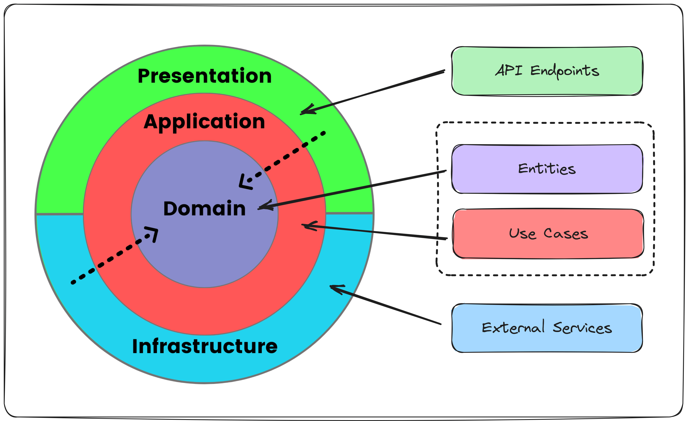

# Clean Architecture có thực sự làm system chậm đi? Performance, complexity và những trade-off thực tế
> Estimated reading time: 12 minutes

Phản biện nhận định Clean Architecture mặc định làm system chậm qua ba góc nhìn: performance,
development complexity và database usage; đồng thời làm rõ mối quan hệ giữa CA, DDD và CQRS.

**Tags:** `dotnet`, `entity-framework-core`, `clean-architecture`, `domain-driven-design`, `cqrs`,
`performance`, `garbage-collection`

## 💠 Tóm tắt bài viết gốc: Tại sao Clean Architecture (CA) làm system chậm đi

**Tác giả:** [Hoai Le (@hoai.le.39904181)](https://www.facebook.com/hoai.le.39904181/)
**Bài viết gốc:** [Facebook post](https://www.facebook.com/hoai.le.39904181/posts/pfbid0t3jFW5DBeAKTCwWfFZZZY91Cgf3fYkbzRCX8wgBSWufqomHB8vRC1nPwbwqv8t46l)

- CA có mục tiêu chính là maintainability, testability và independence khỏi framework/DB/UI.
- Điểm khác với 3-layer là có thêm app domain còn gọi là use case, chứa toàn bộ logic. Logic
  được chia nhỏ ra nhiều use case, không phải 1 god service class. Use case độc lập với DB, ORM,
  controller, ...

- CA không hoàn hảo, chỉ phù hợp cho system cực kỳ lớn, trong khi 3-layer phù hợp với hầu hết
  system vừa & nhỏ.
  1. Quá phức tạp về mặt source code: nhiều layer, nhiều file, nhiều abstraction → gián tiếp làm
     việc phát triển feature chậm lại.
  2. Hiệu năng giảm mạnh: mapping POJO/DTO giữa các layer → áp lực lên GC và tốn CPU.
  3. Không tận dụng được DB: phải `SELECT *`, lấy dư data → tốn network, memory. Logic luôn nằm ở
     domain, khó tận dụng `JOIN`, stored procedure.

**Kết luận của tác giả Hoai Le:** được maintainability, testability / mất performance và tốc độ phát triển.
Tránh nhà nhà clean, người người clean.

---

## 💠 Bài phản biện của mình

**Bản đăng trên Facebook của mình:**
[Facebook post của mình](https://www.facebook.com/hoc081098/posts/pfbid02auonZc7ExVW4Cgfj8fkpSNw1WrPhwLptJRbKZTvSFYvLoXHc6gfSVuQrsV6eUmZ7l)

Đầu tiên, mình phải công nhận bài viết chỉ ra rất nhiều điểm đúng. CA sinh ra không phải để chạy
task, phát triển feature nhanh hay có development velocity cao. Mục tiêu chính như bạn nói:
maintainability, testability và framework independence. So với một implementation sử dụng 3-layer (query thẳng
DB và DTO projection), thì một implementation CA (có thêm việc mapping và các abstraction) có thể tạo ra
performance overhead. Mức độ ảnh hưởng còn phụ thuộc vào cách implement và workload thực tế.

CA áp dụng cho hệ thống nhỏ là over-engineering, điều này đúng trong hầu hết các case nơi chỉ
là CRUD đơn giản, ít business logic, deadline gấp; dùng CA đúng là “dùng dao mổ trâu để giết gà”.
Mapping object qua nhiều layer sẽ tốn chi phí rõ ràng. CA cũng sẽ làm chậm tốc độ phát triển
ban đầu khi phải viết đủ thứ file từ domain, application rồi infrastructure, ... đủ thứ DTO,
abstraction, mapper, ...
Ngoài ra CA yêu cầu dev phải hiểu đúng, hiểu rõ & không phù hợp với mọi bài toán.



*Nguồn ảnh: [Why Clean Architecture Is Great For Complex Projects](https://milanjovanovic.tech/blog/why-clean-architecture-is-great-for-complex-projects) — Milan Jovanović.*

Phần dưới là những điểm mình xin bổ sung/phản biện ở góc độ khác:

---

## 1. CA làm system chậm đi do GC pressure

Mapping qua các boundary có CPU cost và có thể phát sinh allocation, nhưng mức độ ảnh hưởng đến
system phụ thuộc vào workload, volume và latency budget.
Trong nhiều I/O-bound business applications, DB query execution time, storage I/O latency, network latency
và số DB roundtrips có thể chi phối end-to-end latency. Ngược lại, ở batch lớn,
high RPS (requests per second) hoặc low-latency path,
chi phí nhỏ trên từng mapping vẫn có thể cộng dồn, làm giảm throughput hoặc ảnh hưởng tail latency.
Allocation rate cao cũng có thể làm GC diễn ra thường xuyên hơn, như mô tả trong
[.NET GC performance guidance](https://learn.microsoft.com/en-us/dotnet/standard/garbage-collection/performance).

Nếu chỉ kết luận ngay CA làm chậm system thì nghe có vẻ là khái quát hóa quá vội vã (*hasty generalization*).

- **Mapping object không phải bottleneck mặc định.** Trong nhiều I/O-bound business applications,
  DB query execution, storage I/O, network roundtrips, cache behavior hoặc algorithm có thể chi phối
  end-to-end latency nhiều hơn một vài phép mapping đơn giản. Tuy nhiên, đây chỉ là heuristic theo workload;
  mức độ ảnh hưởng vẫn phải được xác nhận bằng profiling/benchmark.

- Khi system chậm, ta không nên quy nguyên nhân ngay cho CA hay việc mapping, mà phải
  profile end-to-end để kiểm tra DB query execution, network roundtrips, serialization, CPU, allocation rate
  và thời gian dành cho GC. Nếu 1 hệ thống chậm đi bởi GC
  thì ta nên profile và tối ưu allocation ở hot path.
  Cũng phải nói thêm, cho dù ta không dùng CA, việc mapping cơ bản trong code,
  hoặc ORM materialization, hoặc serialization vẫn có thể tạo managed allocations.
  Đó là điều đương nhiên ở các ngôn ngữ sử dụng GC: runtime thực hiện allocation trên managed heap,
  GC quản lý heap và thu hồi các object không còn reachable.
  Tựu trung lại, mức độ ảnh hưởng phụ thuộc vào nhiều yếu tố và workload thực tế.

- *DB connection pool starvation* và *cache stampede* là những failure mode có thể ảnh hưởng đến
  reliability/availability của system. Tuy nhiên, những failure mode này không đủ để kết luận rằng
  CPU/allocation overhead của việc mapping có đáng kể hay không; điều đó vẫn phải được xác định bằng
  profiling/benchmark trên workload thực tế.

Giải pháp thực tế (ví dụ với .NET) là:

- Giảm allocation ở hot path bằng cách tránh mapping dư thừa
  và ưu tiên projection trực tiếp từ query (SQL `SELECT` / EF Core `.Select(...)`).
  Performance characteristics của `AutoMapper` và các reflection-based mappers có thể khác nhau,
  vì vậy cần đo riêng thay vì đánh đồng chúng. Chỉ nên cân nhắc thay mapper khi số liệu cho thấy
  implementation hiện tại tạo CPU/allocation overhead đáng kể trên hot path.

- Cache là một trade-off riêng, không phải giải pháp mặc định cho GC pressure. Nó phù hợp hơn với
  read-heavy workloads và những use case chấp nhận dữ liệu cũ trong một khoảng ngắn (*bounded staleness*).
  Với multi-instance systems, ta còn phải xử lý cache invalidation giữa các instance; ví dụ,
  Redis Pub/Sub có thể đóng vai trò như một invalidation backplane. Cache cũng có thể giữ object sống
  lâu hơn, làm tăng memory usage và độ phức tạp khi vận hành.

- Nếu dùng C#, ta có thể dùng `readonly struct` khi nó nhỏ (mốc khoảng ≤ 16 bytes - heuristic,
  không phải rule cứng), immutable, có value semantics, chủ yếu đóng vai trò như là một value container
  thay vì một model of behavior, và không cần inheritance từ base class. Cách sử dụng `struct` này có
  thể tránh một object allocation riêng trên heap khi value không bị boxing, từ đó giảm áp lực lên GC.
  Tuy nhiên, vẫn phải cân nhắc chi phí copy/boxing và xác nhận thực tế bằng profiling/benchmark.

- Chỉ nên dùng chung một model giữa các boundary khi concept, semantics và change lifecycle của model đó
  nhất quán giữa các boundary. Giống nhau về shape thôi thì chưa đủ, vì các model có thể cần evolve độc lập.

Một microbenchmark có thể đo time và allocation của riêng việc mapping, nhưng không đại diện cho
các phần khác như DB/network, concurrency hay tail latency của toàn bộ hệ thống.
Vì vậy, kết luận cuối cùng vẫn phải dựa trên profiling và benchmark với workload và data gần với production.
Đây cũng là điểm được nhấn mạnh trong
[EF Core performance guidance](https://learn.microsoft.com/en-us/ef/core/performance/) và
[EF Core performance diagnosis](https://learn.microsoft.com/en-us/ef/core/performance/performance-diagnosis).

Cái nhìn khác: với các system mà ultra-low latency là yêu cầu cốt lõi (ví dụ như high-frequency trading),
ta có thể cần giảm hoặc bypass một số abstraction ở measured hot path, nhưng vẫn có thể giữ
architectural boundaries ở các phần còn lại.

---

## 2. Sự phức tạp về mặt source code & chậm chạp

Đầu tiên mình xác nhận là mình đồng tình với bạn về việc source code phức tạp hơn và tốc độ phát
triển chậm ban đầu. Nhưng ta phải công nhận sự phức tạp này là sự phức tạp có chủ ý, có trật tự,
không hỗn mang. Nó đến từ sự phân chia rõ ràng và nó biểu lộ sự phức tạp của logic nghiệp vụ
(cái phức tạp sẵn có) ra bên ngoài. Trong mô hình 3-layer, khi responsibility và boundary
không được xác định rõ, business logic có nguy cơ dồn vào service lớn (god service) hoặc bị phân tán giữa
controller (presentation layer), service (business logic layer) và repository (data layer).
Tuy nhiên, mô hình 3-layer không mặc định dẫn đến god service; một implementation được tổ chức
tốt vẫn có thể modular và testable.

Trích lại ý kiến gốc tóm lược:

> Điểm khác với 3-layer là có thêm app domain còn gọi là use case, chứa toàn bộ logic. Logic được
> chia nhỏ ra nhiều use case, không phải 1 god service class. Use case độc lập với DB, ORM,
> controller, ...

Ta cần bóc tách một chút về CA để hiểu chữ “logic” và toàn bộ “logic” có thực sự nằm hết ở use case
hay không. Theo CA gốc, Use Case chứa application-specific business rules và điều phối data flow
đến/từ các Entity. Trong bài này, mình đang xét CA kết hợp với DDD Rich Domain Model: core business
rules và invariants được giữ trong Domain, còn Application Layer chủ yếu điều phối workflow. Với
cách phân chia này, ranh giới về code và logic sẽ rõ ràng hơn.

---

### 2.1. Domain layer (thuần language, không framework)

- Domain model chứa cả data + core business logic + invariant rules + luật tồn tại của domain.
- Entity: có ID, hai entity bằng nhau chỉ cần ID bằng nhau, không cần so sánh toàn bộ content;
  đa số là mutable.
- Value Object: immutable object, không ID, so sánh theo toàn bộ content.
- 1 Bounded Context có thể gồm nhiều Aggregate. Mỗi Aggregate là một cluster của các Entity và Value Object,
  được xem như một _consistency boundary_.
  Mọi update từ bên ngoài Aggregate chỉ được đi qua entry point của Aggregate là Aggregate Root.
- Ví dụ: `Order` không thể có `total ≤ 0`, `Order` đã paid không thể cancel, `User` không thể tự gán
  role `Admin`.

→ Rõ ràng domain layer có business logic, nhưng đây là logic cốt lõi và bất biến (invariant). Chỗ
này không có gì phức tạp cả, nó chỉ áp dụng các nguyên lý OOP, SOLID, và code như class thông thường.

---

### 2.2. Application layer

Layer này mới chứa Use Case.
Use Case chứa application-specific rules/workflow và điều phối nghiệp vụ (orchestration logic),
không tự triển khai lại core business rules hay invariants của Aggregate.

> Nếu ứng dụng .NET chọn kết hợp thêm CQRS, Use Case thường được triển khai dưới dạng
> `CommandHandler`/`QueryHandler`.

---

Một rule of thumb thực dụng là:

- **Aggregate:** quyết định một state transition có hợp lệ hay không dựa trên business invariants.
- **Application Layer:** quyết định cần gọi những Aggregate hoặc hệ thống bên ngoài nào,
  ở bước nào và theo trình tự nào trong transaction/workflow.

Nếu logic chủ yếu là orchestration giữa nhiều thành phần hoặc tích hợp với bên ngoài, Application
Layer thường là nơi phù hợp; implementation cụ thể của external integration nằm ở Infrastructure
Layer.

---

### 2.3. Ví dụ

Ta lấy ví dụ Cancel order:

```text
UseCase: CancelOrder(orderId, reason, actorId, requestId)

begin transaction
  order = OrderRepo.GetByIdForUpdate(orderId) // includes paymentRef, amount, customerEmail
  if order == null → NotFound

  order.Cancel(reason, actorId) // domain: enforce invariants
  OrderRepo.Save(order)

  Outbox.Add("RefundRequested", { orderId, paymentRef, amount, requestId })
  Outbox.Add("CancelEmailRequested", { orderId, customerEmail, requestId })
commit
```

- Nhiều người nhầm chỗ này. Use Case không nên triển khai lại invariant rule hoặc tự quyết định
  domain state transition thay cho Aggregate. Nó vẫn có thể xử lý application-level concerns như
  validation của request (cơ bản như `null`, empty, invalid format, ...), authorization, idempotency,
  resource existence và transaction boundary.
  Use Case dùng Domain Layer + các abstraction (interface) được định nghĩa trong Application Layer.
  Implementation của các abstraction này nằm ở Infrastructure Layer.

→ Vậy logic chỗ này có phức tạp không? Theo mình là không. Nó chỉ refer Domain Layer (thuần code) +
interface. Việc Use Case phụ thuộc vào interface thay vì implementation cụ thể cho phép ta thay
dependency bằng test double (mock/fake) khi unit test. Đây chỉ là OOP căn bản.

Điểm yếu là giai đoạn đầu sẽ chậm, nhưng đó là cái giá phải trả. Với dự án lớn và được tổ chức tốt,
boundary rõ ràng có thể giúp dev mới lần theo logic nhanh hơn, dễ hơn và giảm phạm vi ảnh hưởng khi thay đổi.
Tuy nhiên, CA không tự động khiến code trở nên dễ test, dễ onboarding hay giúp ta tránh việc sửa
chỗ này hỏng chỗ kia. Những lợi ích này còn phụ thuộc vào cách chia boundary, chất lượng test và
discipline của team.

---

## 3. CA không tận dụng được DB

Mình xin phản biện lại như sau: **CA không cấm dùng projection, `JOIN`, raw SQL hay stored procedure.**
Repository không bắt buộc generic. Nếu chọn CQRS, read model có thể tách riêng khỏi write model.

- `SELECT *`: bạn hoàn toàn có thể tạo method đặc thù trong repository để lấy dữ liệu theo từng
  trường hợp, ví dụ: `getBasicInfoById`, `getByIdWithRoles`, ... EF Core hỗ trợ projection qua
  `.Select(...)` để chỉ lấy các field cần thiết, và `.Include(...)` để eager-load (các) navigation
  properties. SQL được generate ra còn phụ thuộc vào query shape và cấu hình single/split query. Với
  single-query mode, EF Core thường dùng `JOIN`; với split-query mode, collection navigation có thể
  được load qua nhiều SQL queries. Vì vậy, rõ ràng ta có thể kiểm soát được những gì ta cần,
  chứ không phải là `SELECT *` một cách máy móc và vô tội vạ.

- Domain layer không phải nơi viết DB query phức tạp, nó chỉ chứa business rules. DB Query nó thuộc
  Infrastructure Layer. Ở đây có vẻ như đang “lấy râu ông nọ, chắp cằm bà kia”, lẫn lộn trách nhiệm
  giữa các layer, nên dễ dẫn tới kết luận rằng CA “cấm” tối ưu DB.

---

Trước hết, ta phải hiểu rằng: **CA, DDD và CQRS là các lựa chọn độc lập vì chúng giải quyết những concern khác nhau:**

- **CA:** tập trung vào layer boundaries và dependency direction. Domain không phụ thuộc vào framework
  hay external concerns; Application phụ thuộc vào Domain; Infrastructure/Data và Presentation nằm
  bên ngoài và depend inward thông qua các abstraction/port.

- **DDD:** tập trung vào modeling domain và boundary của nó thông qua Bounded Context, Entity, Value Object,
  Aggregate, invariants, Domain Event (fact đã xảy ra trong domain) và cách biểu diễn domain error.

- **CQRS:** tách write/mutation path (`Command`) khỏi read-only path (`Query`) để mỗi bên có thể được model
  và tối ưu độc lập.

Chúng có thể kết hợp, nhưng CA không mặc định yêu cầu sử dụng DDD hoặc CQRS. Nếu chọn CQRS, ta có thể nhìn
việc tách read/write ở hai mức:

- **Logical CQRS:** tách command/query model và code path, nhưng vẫn có thể dùng chung một database.
- **Physical CQRS:** tách read/write side ở persistence/data layer và có thể dùng data store riêng.
  Cách này tạo thêm bài toán data synchronization và consistency.

---

Quay lại việc tối ưu DB, trong cách kết hợp CA + DDD Rich Domain Model + CQRS đang được nói tới:

- Với `Command`, không phải lúc nào cũng cần phải load Aggregate.
  - Khi Command thay đổi state của một Aggregate đang tồn tại và state đó được bảo vệ bởi invariants,
    Use Case cần load hoặc rehydrate Aggregate Root cùng state cần thiết,
    sau đó gọi domain behavior để thay đổi state, rồi persist. Cách này có thể sẽ load nhiều hơn
    “minimal data”, nhưng ta ưu tiên invariants hơn tối ưu vi mô.
  - Nếu Command chỉ tạo Aggregate mới thì chỉ cần dùng constructor/factory rồi persist là đủ.
    Còn các operation không dựa trên Aggregate invariants thì có thể dùng write path đơn giản hơn.

- Với `Query`, ta có thể bypass domain, viết 1 service interface riêng ở Application Layer,
  và implementation ở Infrastructure layer dùng Dapper hoặc EF Core projection hoặc raw SQL trả về DTO,
  trong đó DTO khai báo ở Application Layer.
  DTO chỉ chứa field cần thiết → tận dụng full sức mạnh SQL (`JOIN`, `GROUP BY`, `HAVING`, stored procedure...).

CQRS tạo thêm command/query path, model cũng như abstraction, nên nó có thể không phù hợp với các bài toán CRUD đơn giản
hoặc hệ thống không cần tối ưu read/write độc lập.
Chung quy lại, CA không ngăn cản ta tận dụng các kỹ thuật tối ưu DB, nhưng đổi lại ta phải chấp nhận thêm abstraction.

---

## Kết luận

CA có trade-off và cost thật, nhưng nó không phải bottleneck mặc định. Vấn đề performance, DB usage
hay tốc độ phát triển thường đến từ sự cứng nhắc, không phải bản thân CA. CA là kim chỉ nam, không
phải giáo điều. Với dự án nhỏ, CRUD đơn giản và ít business logic, lợi ích của việc áp dụng đầy đủ CA
thường không tương xứng với complexity phát sinh. **Đừng coi CA là template, hãy coi nó là guideline.**
