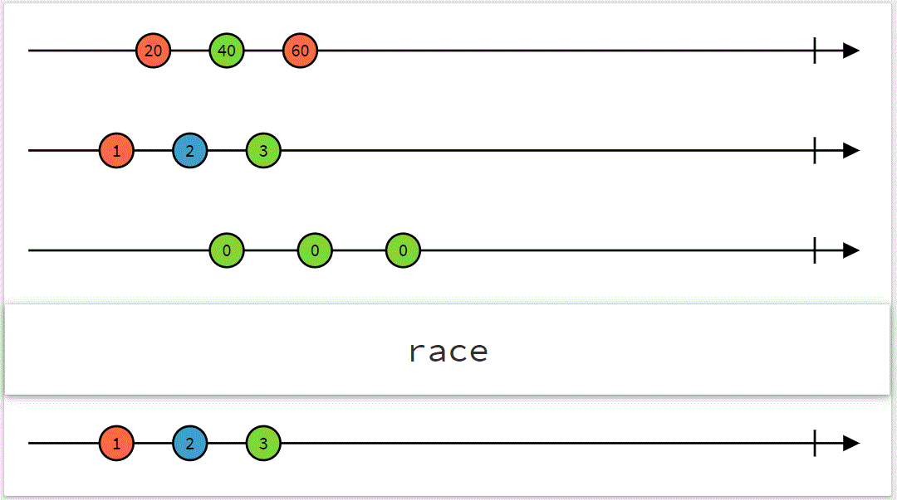

# Implementing a race/amb operator for Kotlin Coroutines Flow.

> - Estimated reading time: 4 minutes
> - Original article: https://proandroiddev.com/implement-race-amb-operator-with-kotlin-coroutines-flow-a59f17997b67
> - Originally published: March 24, 2022

---

Hello, Kotlin developers! Let's implement a `race`/`amb` operator for `Flow`.
This operator is similar to the `race` operator in RxJS and the `amb` operator in RxJava.
See the documentation below for more details.

`race` collects multiple `Flow`s concurrently. As soon as one `Flow` emits a value,
fails with a `Throwable`, or completes, it becomes the “winner.” The others are canceled,
and the resulting `Flow` mirrors the winner from that first event onward.



_The RxJS `race` operator (source: [RxJS documentation](https://rxjs.dev/api/index/function/race))_

> [https://rxjs.dev/api/index/function/race](https://rxjs.dev/api/index/function/race)
>
> Returns an observable that mirrors the first source observable to emit an item.
>
> [https://reactivex.io/documentation/operators/amb.html](https://reactivex.io/documentation/operators/amb.html)
>
> When you pass a number of source Observables to Amb, it will pass through the emissions
> and notifications of exactly one of these Observables: the first one that sends
> a notification to Amb, either by emitting an item or sending an onError
> or `onCompleted` notification. Amb will ignore and discard the emissions
> and notifications of all of the other source Observables.

## Use case and example

This operator is useful when multiple data sources can provide equivalent values—for example,
multiple API endpoints—but their response times vary unpredictably with network conditions.
In this case, we want to use whichever source responds first and ignore the slower ones.

Here is an example:

```kotlin
@ExperimentalCoroutinesApi
public fun <T> race(flows: Iterable<Flow<T>>): Flow<T> = TODO("Will implement")

fun firstSource(): Flow<String> = flow {
  delay(400)
  repeat(10) {
    emit("[1] - $it")
    delay(100)
  }
}

fun secondSource(): Flow<String> = flow {
  delay(100)
  repeat(10) {
    emit("[2] - $it")
    delay(100)
  }
}

fun thirdSource(): Flow<String> = flow {
  delay(500)
  repeat(10) {
    emit("[3] - $it")
    delay(100)
  }
}

suspend fun main() {
  race(
    listOf(
      firstSource(),
      secondSource(),
      thirdSource()
    )
  ).collect { println(it) }
  // CONSOLE
  // [2] - 0
  // [2] - 1
  // [2] - 2
  // [2] - 3
  // [2] - 4
  // [2] - 5
  // [2] - 6
  // [2] - 7
  // [2] - 8
  // [2] - 9
}
```

Only values from the second `Flow` are emitted because it begins emitting before the others.

## Implementation

`race` works as follows:

1. Collect all source `Flow`s concurrently.
2. Wait for the first event from any source `Flow`; that source becomes the winner.
3. Cancel all other `Flow`s.
4. Forward all events from the winning `Flow` downstream.

Here is the implementation of `race`:

```kotlin
import kotlinx.coroutines.ExperimentalCoroutinesApi
import kotlinx.coroutines.channels.ChannelResult
import kotlinx.coroutines.channels.onFailure
import kotlinx.coroutines.channels.onSuccess
import kotlinx.coroutines.channels.produce
import kotlinx.coroutines.coroutineScope
import kotlinx.coroutines.flow.Flow
import kotlinx.coroutines.flow.emitAll
import kotlinx.coroutines.flow.flow
import kotlinx.coroutines.selects.select
import kotlinx.coroutines.yield

@ExperimentalCoroutinesApi
public fun <T> race(flows: Iterable<Flow<T>>): Flow<T> = flow {
  coroutineScope {
    // 1. Collect all source Flows concurrently.
    val channels = flows.map { flow ->
      // Produce the values using the default (rendezvous) channel
      produce {
        flow.collect {
          send(it)
          yield() // Give other coroutines a chance to run
        }
      }
    }

    // If the channel list is empty, return and complete the resulting Flow.
    if (channels.isEmpty()) {
      return@coroutineScope
    }

    // If there is only one channel, forward all events from it.
    channels
      .singleOrNull()
      ?.let { return@coroutineScope emitAll(it) }

    // 2. Wait for the first event from any source Flow.
    // A select expression lets us await multiple suspending operations simultaneously
    // and choose the first one that becomes available.
    val (winnerIndex, winnerResult) = select<Pair<Int, ChannelResult<T>>> {
      channels.forEachIndexed { index, channel ->
        channel.onReceiveCatching {
          index to it
        }
      }
    }

    // 3. Cancel all other Flows.
    channels.forEachIndexed { index, channel ->
      if (index != winnerIndex) {
        channel.cancel()
      }
    }

    // 4. Forward all events from the winning Flow downstream.
    winnerResult
      .onSuccess {
        emit(it)
        emitAll(channels[winnerIndex])
      }
      .onFailure {
        it?.let { throw it }
      }
  }
}
```

Using a [select expression](https://kotlinlang.org/docs/select-expression.html),
we can _select_ the first event that becomes available from any of the channels.
For more details, see
[selecting from channels](https://kotlinlang.org/docs/select-expression.html#selecting-from-channels).

As a bonus, we can add a vararg overload of `race` and a `raceWith` extension function on `Flow`:

```kotlin
@ExperimentalCoroutinesApi
public fun <T> race(
  flow1: Flow<T>,
  flow2: Flow<T>,
  vararg flows: Flow<T>
): Flow<T> =
  race(
    buildList(capacity = 2 + flows.size) {
      add(flow1)
      add(flow2)
      addAll(flows)
    }
  )

@ExperimentalCoroutinesApi
public fun <T> Flow<T>.raceWith(
  flow: Flow<T>,
  vararg flows: Flow<T>
): Flow<T> = race(
  buildList(capacity = 2 + flows.size) {
    add(this@raceWith)
    add(flow)
    addAll(flows)
  }
)
```

## Conclusion

We have implemented the `race` operator.
Using channels and a select expression makes handling backpressure
and concurrency much easier.

You can find the full implementation and other `Flow` operators in
[FlowExt](https://github.com/hoc081098/FlowExt), along with the complete source code,
documentation, and setup instructions for adding the library to your project.

FlowExt is a Kotlin Multiplatform library that provides many operators
and extensions for Kotlin Coroutines `Flow`, including `concat`/`concatWith`, `interval`, `timer`,
`race`/`amb`, `raceWith`/`ambWith`, `flatMapFirst`/`exhaustMap`,
`materialize`/`dematerialize`, `takeUntil`, `throttleTime`, `retryWithExponentialBackoff`,
and `withLatestFrom`.

Thanks for reading! ❤
If you liked this article, please follow me on
[Medium](https://hoc081098.medium.com/), [GitHub](https://github.com/hoc081098),
and [Twitter](https://twitter.com/hoc081098).
